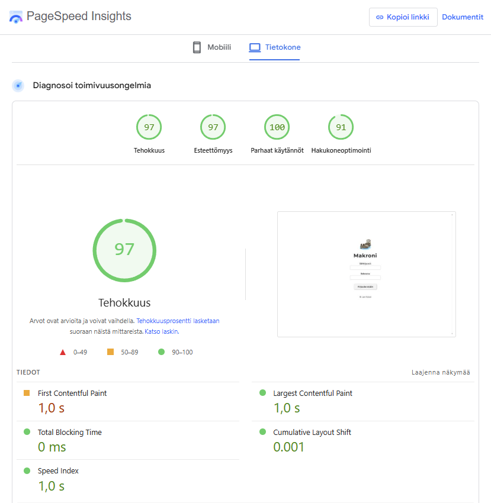
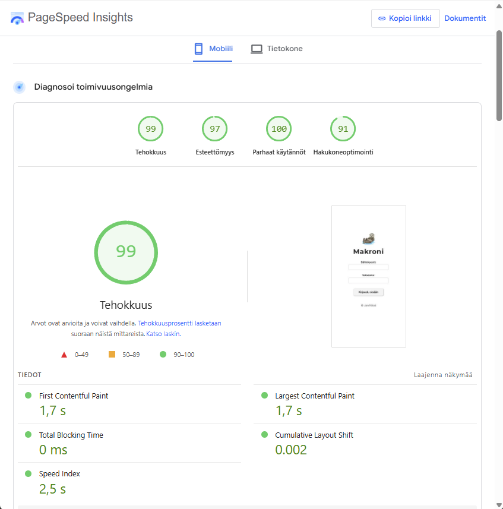

# Harjoitustyö
Pvm. 14.12.2025

<a href="./app/" target="_blank" rel="noopener noreferrer">Makroni - Web-sovellus</a>

Makroni web-sovellus - Raportti

## 1. Sovelluksen kuvaus ja toteutus

Makroni on web-sovellus, joka toimii ateriakoostajana. Käyttäjä voi valita ruoka-aineita, syöttää niille grammamäärät ja nähdä reaaliajassa päivittyvät ravintoarvot (kalorit, proteiini, hiilihydraatit ja rasva). Sovellus laskee makrot automaattisesti ja kokoaa niistä valmiin aterian, jonka käyttäjä voi tallentaa myöhempää tarkastelua varten. Tallennetut ateriat näkyvät omalla sivullaan, josta ne voidaan avata uudelleen katsottaviksi.

Sovellus on toteutettu Haaga-Helia ammattikorkeakoulun Pilvipalvelut web-kehityksessä -kurssin harjoitustyönä. Kurssilla ollaan harjoiteltu modernien web-teknologioiden käyttöä, kuten autentikointia, tietokantaa ja dynaamista käyttöliittymää, yksinkertaisessa mutta toimivassa sovelluksessa.

Web-sovelluksen toteutuksessa on käytetty Viteä, Reactia ja Firebasea. Käyttäjien kirjautuminen on toteutettu Firebase Authenticationin avulla ja ateriat tallennetaan Firestore-tietokantaan käyttäjäkohtaisesti.

## 2. Käytettävyys ja Nielsenin heuristiikat

Käytettävyyttä arvioitiin Nielsenin heuristiikkojen pohjalta käyttäjätestauksella. Sovellusta testasi yhteensä seitsemän henkilöä (ikähaarukka 25–55 vuotta, miehiä ja naisia).

Kaikkien testaajien mielestä sovelluksen idea ja navigaatio olivat selkeitä. Käyttäjät osasivat siirtyä eri sivujen välillä ilman erillistä ohjeistusta ja ymmärsivät nopeasti sovelluksen perustoimintalogiikan. Jokaiselta sivulta on mahdollista navigoida muille sivuille sekä sivukohtaisilla painikkeilla että yhteisellä yläreunan navigaatiopalkilla, josta näkee myös aktiivisen sivun.

Käyttäjä saa välitöntä palautetta toiminnoistaan, kuten ruoka-aineiden lisäämisestä ja aterian tallentamisesta tai jos ateriaa yrittää poistaa.

Kahdella testaajalla ilmeni mobiililaitteella selaimesta riippuvia skaalautuvuusongelmia, mutta nämä korjattiin CSS-muutoksilla. Korjausten jälkeen vastaavia ongelmia ei enää havaittu.

## 3. WCAG ja saavutettavuus

Sovelluksen ulkoasu ja rakenne täyttävät WCAG-ohjeistuksen perusvaatimukset MVP-vaiheen sovellukselle. Tekstin kontrasti on riittävä, painikkeet erottuvat selkeästi taustasta ja teksti on luettavaa eri päätelaitteilla.

Navigointi on loogista ja ennustettavaa, eikä käyttäjän tarvitse muistaa edellisiä vaiheita sovelluksen käyttämiseksi. Tekstisisällöt ovat selkeitä ja ymmärrettäviä.

## 4. Responsiivisuus

Responsiivisuutta testattiin Chrome DevTools -työkalulla useilla näyttöleveyksillä sekä käytännössä eri mobiilipäätteillä ja selaimilla.

**Työpöytä:**  
Käyttöliittymä skaalautuu oikein ja kaikki sisältö on selkeästi näkyvissä.

**Mobiililaitteet:**  
Käyttöliittymä mukautuu hyvin eri kokoisille puhelimille. Navigointi onnistuu yhdellä kädellä ja kaikki toiminnot ovat käytettävissä ilman zoomausta.

**Tabletit:**  
Sovellus toimii oikein sekä pysty- että vaakanäkymässä. Testeissä ei havaittu ongelmia skaalautuvuudessa.

## 5. Selainyhteensopivuus

Sovelluksen toimivuutta testattiin kolmella eri selaimella:

- **Google Chrome:** kaikki toiminnot toimivat suunnitellusti  
- **Microsoft Edge:** toimii kuten Chrome, ilman havaittuja ongelmia  
- **Safari (iOS):** yhdellä iPhone-käyttäjällä ilmeni automaattinen zoomaus input-kenttään ateriaa koostettaessa. Tämä johtui iOS:n oletuskäyttäytymisestä alle 16 px fonttikokojen kohdalla. Ongelma korjattiin asettamalla input-kenttien fonttikooksi vähintään 16 px (tässä tapauksessa 1rem), minkä jälkeen zoomausta ei enää tapahtunut.

## 6. Suorituskyky ja latausajat

Sivujen latautumisaikaa mitattiin Google Lighthouse -työkalulla.

### Aloitusnäkymä (kirjautumissivu)

**Työpöytä (PageSpeed Insights):**

- Tehokkuus: 97  
- Esteettömyys: 97  
- Parhaat käytännöt: 100  
- Hakukoneoptimointi: 91  

**Mobiili (PageSpeed Insights):**

- Tehokkuus: 99  
- Esteettömyys: 97  
- Parhaat käytännöt: 100  
- Hakukoneoptimointi: 91  

Lisäksi koko sovelluksen suorituskykyä testattiin Chrome DevTools Performance -työkalulla nauhoittamalla sovelluksen käyttöä.

Mittauksen aikana suoritettiin tyypillisiä käyttäjätoimintoja: ruoka-aineiden lisääminen, aterioiden tarkastelu, sivujen välinen navigointi sekä uloskirjautuminen. Mittausjakson kesto oli noin 37 sekuntia. JavaScriptin suoritus vei noin 2,48 sekuntia, renderöinti noin 157 ms ja piirtäminen noin 85 ms.

Testin aikana ei havaittu pitkiä pääsäikeen lukkiutumisia eikä käyttöliittymän nykimistä. Sovellus reagoi käyttäjän toimintoihin sujuvasti.

Johtopäätöksenä voidaan todeta, että sivujen latausajat ja suorituskyky ovat kohtuulliset.

## 7. Yhteenveto

Makroni on toimiva ja selkeä web-sovellus, joka täyttää asetetut vaatimukset. Sovellus noudattaa Nielsenin heuristiikkojen periaatteita, täyttää WCAG:n perusvaatimukset, toimii responsiivisesti eri päätelaitteilla ja on yhteensopiva yleisimpien selainten kanssa.

Suorituskyky ja latausajat ovat hyvät, ja käyttäjätestauksen perusteella sovellusta on helppo käyttää ilman erillistä ohjeistusta.
